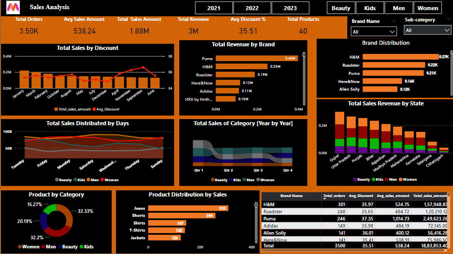

# Myntra Sales Analysis — Reducing Product Returns

<!-- live-links -->
> 🔗 **Live project page:** [s-harshni.github.io/myntra-returns-reduction-analysis](https://s-harshni.github.io/myntra-returns-reduction-analysis/)  
> 👤 **Portfolio:** [s-harshni.github.io/S-Harshni](https://s-harshni.github.io/S-Harshni/)  
<!-- live-links -->

A Power BI analysis of Myntra fashion e-commerce sales data. It defines revenue and order KPIs, shows which brands, categories and states drive sales, and frames product recommendations for the business problem of **high return rates caused by size and fit uncertainty**.

## Business problem

Fashion e-commerce platforms such as Myntra face:
- high product return rates
- low customer confidence in size and fit
- revenue lost to weak product-level insight

**Target users:** online fashion shoppers, especially first-time buyers and shoppers unsure about size and fit.

## What the dashboard answers

| Question | Visual |
|---|---|
| How is the business doing overall? | KPI cards: total revenue, orders, sales amount, total products |
| Which brands earn the most? | Revenue by brand, owned-brand product counts |
| Which categories sell, and when? | Daily sales distribution by category |
| Where do sales come from? | Sales by category across 20+ states |
| What sells best within each category? | Top products per category |

## Dashboard views

| Revenue by brand | Sales by category |
|---|---|
|  |  |

| Revenue by state | Sales distribution |
|---|---|
|  |  |

## Approach

1. **Requirements:** documented the business questions and KPIs ([`Business Requirements.docx`](Business%20Requirements.docx)).
2. **Data preparation:** cleaned and shaped the Kaggle Myntra sales data in Excel ([`Myntra dataset.xlsx`](Myntra%20dataset.xlsx)).
3. **Modelling & DAX:** built KPI measures and category/brand/state breakdowns in Power BI.
4. **Dashboard:** interactive report with slicers for year and category ([`Myntra Sales Analysis Dashboard.pbix`](Myntra%20Sales%20Analysis%20Dashboard.pbix)).
5. **Recommendations:** size/fit-focused product ideas to reduce returns, summarised in [`Myntra PPT.pptx`](Myntra%20PPT.pptx).

## Files

| File | Contents |
|---|---|
| `Myntra Sales Analysis Dashboard.pbix` | Power BI report (open with Power BI Desktop, free) |
| `Myntra dataset.xlsx` | Source sales data |
| `Business Requirements.docx` | Problem statement, KPIs and requirements |
| `Myntra PPT.pptx` | Findings and recommendations deck |
| `Images/` | Dashboard screenshots |
| `docs/` | Project page served on GitHub Pages |

## Tools

Power BI Desktop (DAX, slicers, map and bar visuals) · Microsoft Excel · Kaggle dataset

## Credits

The Power BI report, dataset and requirements document follow the Myntra sales analysis by [rahulrajan-1519](https://github.com/rahulrajan-1519/Myntra_sales_analysis). This repository adds the returns-reduction framing, the project page and documentation.

## Author

**S Harshni** · [Portfolio](https://s-harshni.github.io/S-Harshni/) · [LinkedIn](https://www.linkedin.com/in/ks-harshni/) · [GitHub](https://github.com/S-Harshni)
